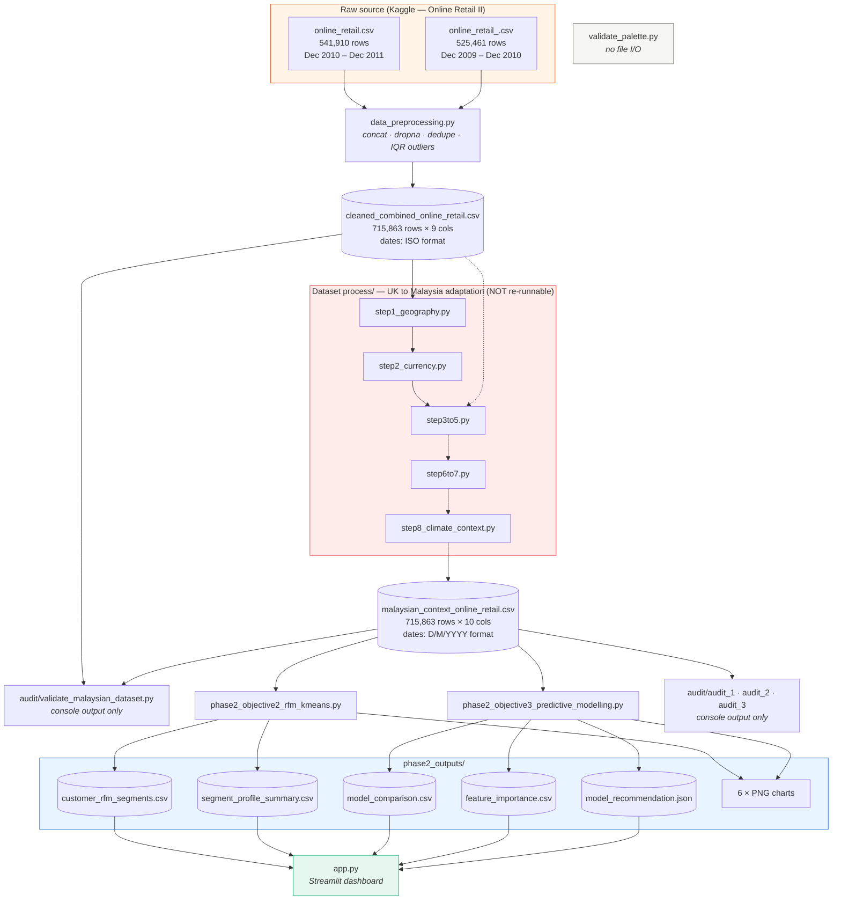

# Data Lineage — FYP Project

**Audited:** 20 August 2026 · Every `read_csv` / `to_csv` / `open` call in all 14 Python scripts was extracted and verified by execution, not by reading code alone.

---

## 1. The pipeline



---

## 2. Script-by-script inventory

| # | Script | Reads | Writes |
|---|--------|-------|--------|
| 1 | `data_preprocessing.py` | `online_retail.csv`<br/>`online_retail_.csv` | `cleaned_combined_online_retail.csv` |
| 2 | `Dataset process/step1_geography.py` | `cleaned_combined_online_retail.csv` ⚠️ | `step1_geography_output.csv` ⚠️ |
| 3 | `Dataset process/step2_currency.py` | `step1_geography_output.csv` ⚠️ | `step2_currency_output.csv` ⚠️ |
| 4 | `Dataset process/step3to5.py` | `cleaned_combined_online_retail.csv` ⚠️<br/>`step2_currency_output.csv` ⚠️ | `malaysian_context_online_retail.csv` ⚠️<br/>`validation_histograms.png` |
| 5 | `Dataset process/step6to7.py` | `malaysian_context_online_retail.csv` ⚠️ | `malaysian_context_online_retail.csv` ⚠️ **(in place)** |
| 6 | `Dataset process/step8_climate_context.py` | `malaysian_context_online_retail.csv` ⚠️ | `malaysian_context_online_retail.csv` ⚠️ **(in place)**<br/>`description_localization_mapping.csv` |
| 7 | `audit/validate_malaysian_dataset.py` | `cleaned_combined_online_retail.csv`<br/>`malaysian_context_online_retail.csv` | *nothing — console only* |
| 8 | `phase2_objective2_rfm_kmeans.py` | `malaysian_context_online_retail.csv` | `phase2_outputs/customer_rfm_segments.csv`<br/>`phase2_outputs/segment_profile_summary.csv`<br/>3 PNGs |
| 9 | `phase2_objective3_predictive_modelling.py` | `malaysian_context_online_retail.csv` | `phase2_outputs/model_comparison.csv`<br/>`phase2_outputs/feature_importance.csv`<br/>`phase2_outputs/model_recommendation.json`<br/>3 PNGs |
| 10 | `audit/audit_1_leakage_and_rigour.py` | `malaysian_context_online_retail.csv` | *nothing — console only* |
| 11 | `audit/audit_2_clustering.py` | `malaysian_context_online_retail.csv` | *nothing — console only* |
| 12 | `audit/audit_3_accuracy.py` | `malaysian_context_online_retail.csv` | *nothing — console only* |
| 13 | `validate_palette.py` | *nothing* | *nothing* |
| 14 | `app.py` | `phase2_outputs/` — 4 CSVs + 1 JSON | *nothing* |

⚠️ = hardcoded sandbox path (`/mnt/user-data/…`, `/home/claude/…`) that does not exist on this machine. See §6.

---

## 3. (a) Is `online_retail_.csv` a leftover duplicate?

**No. It is essential — it holds an entire year of data that exists nowhere else.**

| | `online_retail.csv` | `online_retail_.csv` |
|---|---|---|
| MD5 | `a85f4a1f…` | `784ecb68…` — **different** |
| Rows | 541,910 | 525,461 |
| Date range | **2010-12-01 → 2011-12-09** | **2009-12-01 → 2010-12-09** |

These are the two sheets of the Kaggle *Online Retail II* dataset — one per trading year. Deleting `online_retail_.csv` would remove roughly **half your raw data** and cut the study period from two years to one, which would in turn break the temporal train/test split that Objective 3 depends on (its 546-day observation window does not fit inside a single year).

⚠️ **The naming is genuinely misleading.** The file with the trailing underscore is the *earlier* period, so the alphabetical order is the reverse of the chronological order. This is exactly the kind of thing that invites an accidental deletion. Consider renaming to `online_retail_2009_2010.csv` and `online_retail_2010_2011.csv` — but if you do, update lines 18–19 of `data_preprocessing.py`.

**One nuance worth putting in your report.** The two files overlap for about nine days (2010-12-01 → 2010-12-09), producing **34,335 exactly duplicated rows** when concatenated. `data_preprocessing.py` calls `drop_duplicates()` at Step 8, which removes them — so there is **no double-counting** in your cleaned data. But this is a deliberate handling step, not luck, and an examiner asking "why did you concatenate two overlapping files?" deserves that answer.

---

## 4. (b) Does `app.py` read any CSV directly?

**No. It reads only `phase2_outputs/` — five files, and nothing else.**

```
phase2_outputs/customer_rfm_segments.csv     -> load_customers()
phase2_outputs/segment_profile_summary.csv   -> load_segment_profile()
phase2_outputs/model_comparison.csv          -> load_model_comparison()
phase2_outputs/feature_importance.csv        -> load_feature_importance()
phase2_outputs/model_recommendation.json     -> load_recommendation()
```

It never touches `malaysian_context_online_retail.csv`, the cleaned file, or either raw file. Paths resolve via `Path(__file__).parent / "phase2_outputs"`, so the dashboard works regardless of which directory you launch it from.

This is the "pure presentation layer" property — the dashboard cannot silently disagree with your report, because it displays the same saved numbers rather than recomputing them.

---

## 5. (c) If you keep only `malaysian_context_online_retail.csv` + `phase2_outputs/`

### ✅ Still works — 8 of 14 scripts

| Script | Why |
|---|---|
| `app.py` (all three pages) | Reads only `phase2_outputs/` |
| `phase2_objective2_rfm_kmeans.py` | Reads only the Malaysian CSV; regenerates its outputs |
| `phase2_objective3_predictive_modelling.py` | Reads only the Malaysian CSV; regenerates its outputs |
| `audit/audit_1_leakage_and_rigour.py` | Reads only the Malaysian CSV |
| `audit/audit_2_clustering.py` | Reads only the Malaysian CSV |
| `audit/audit_3_accuracy.py` | Reads only the Malaysian CSV |
| `validate_palette.py` | No file I/O at all |

**Your entire Phase 2 and Objective 4 remain fully reproducible.** You can regenerate every file in `phase2_outputs/` from scratch, re-run all three audits, and run the dashboard.

### ❌ Breaks — 6 of 14 scripts

| Script | Missing input |
|---|---|
| `data_preprocessing.py` | Both raw CSVs |
| `audit/validate_malaysian_dataset.py` | `cleaned_combined_online_retail.csv` (needs it as the before/after comparison baseline) |
| `Dataset process/step1…step8` (5 scripts) | Already broken regardless — see §6 |

### What you actually lose

Only the ability to **re-derive** the Malaysian dataset and to **re-prove** that the adaptation preserved Phase 1's properties. The validation has already been run and passed, and its results are recorded in `PHASE2_AUDIT_REPORT.md`. Nothing downstream depends on those files.

### Recommendation

**Do not delete anything locally.** Keep every file on your own machine — if your examiner asks you to demonstrate Phase 1, you need the raw files, and re-downloading them later is avoidable risk.

The question is really about **what to push to GitHub** for Streamlit Community Cloud, and there the answer is stronger than you might expect: since `app.py` reads *only* `phase2_outputs/`, **none of the four large CSVs need to be in the deployed repo at all.**

| File | Size | Needed to deploy? |
|---|---|---|
| `online_retail.csv` | 43.5 MB | No |
| `online_retail_.csv` | 42.3 MB | No |
| `cleaned_combined_online_retail.csv` | **67.6 MB** | No |
| `malaysian_context_online_retail.csv` | **62.7 MB** | No |
| `phase2_outputs/` (CSVs + JSON) | 397 KB | **Yes** |
| `phase2_outputs/` (including PNGs) | 929 KB | optional |

That is **216 MB** of source data supporting a dashboard that needs under 1 MB.

This matters practically: GitHub warns on any file above 50 MB and hard-blocks at 100 MB. The two bolded files exceed the warning threshold; the two raw files sit just under it. Excluding all four sidesteps the issue entirely and keeps the Community Cloud container small.

Add a `.gitignore`:

```gitignore
online_retail.csv
online_retail_.csv
cleaned_combined_online_retail.csv
malaysian_context_online_retail.csv
```

Your deployed repo then needs only `app.py`, `requirements.txt`, `.streamlit/config.toml`, and `phase2_outputs/` — a few hundred kilobytes. Full reproducibility stays intact on your local machine.

---

## 6. Two issues found during this audit

### 6.1 The `audit/` scripts now break unless run from the project root

The four scripts in `audit/` use bare relative paths (`pd.read_csv("malaysian_context_online_retail.csv")`) but now live in a subfolder. Verified by execution:

```bash
cd audit && python validate_malaysian_dataset.py     # ❌ FileNotFoundError
cd .. && python audit/validate_malaysian_dataset.py  # ✅ all 6 checks PASS
```

**Always run them from the project root.** If you would rather make them location-independent, change the path constant at the top of each to:

```python
from pathlib import Path
ROOT = Path(__file__).resolve().parent.parent
df = pd.read_csv(ROOT / "malaysian_context_online_retail.csv", encoding="ISO-8859-1")
```

### 6.2 The two datasets store dates in different formats — a latent trap

| File | Stored format | Correct parse |
|---|---|---|
| `cleaned_combined_online_retail.csv` | `2010-12-01 08:26:00` (ISO) | `pd.to_datetime(col)` — **no** `dayfirst` |
| `malaysian_context_online_retail.csv` | `1/12/2010 8:26` (D/M/YYYY) | `pd.to_datetime(col, dayfirst=True)` |

Applying `dayfirst=True` to the **cleaned** file silently corrupts it — the range shifts from `2009-12-01 → 2011-12-09` to `2009-01-12 → 2011-12-10`, with no error raised.

**This is not currently a live bug:** `validate_malaysian_dataset.py` is the only script reading both files, and it never parses `InvoiceDate` (it compares Quantity, Price, TotalAmount and Customer ID only). But it would bite the moment you add a date-based check across the two. Noted here so it does not.

### 6.3 The adaptation is not currently re-runnable (reproducibility gap)

All five `Dataset process/` scripts hardcode sandbox paths from the environment they were originally written in:

```python
pd.read_csv("/mnt/user-data/uploads/cleaned_combined_online_retail.csv")
df.to_csv("/home/claude/step1_geography_output.csv", index=False)
```

None of these paths exist on this machine, so **`malaysian_context_online_retail.csv` cannot presently be regenerated from source.** The file you have is the authoritative copy — its validation passed, so this does not undermine your results, but it *is* a reproducibility gap an examiner could reasonably raise.

Two further risks in those scripts: steps 6, 7 and 8 **overwrite `malaysian_context_online_retail.csv` in place**, so a partial re-run could corrupt the file with no backup; and step 2's currency conversion would **double-apply** if run twice (every price ×5.50 again).

**Low-effort fix** if you want to close the gap: replace the hardcoded paths with a `ROOT = Path(__file__).resolve().parent.parent` constant, have each step write to a distinct filename rather than overwriting, and state in your methodology that the pipeline is re-runnable end to end. Worth doing if your report claims full reproducibility.
